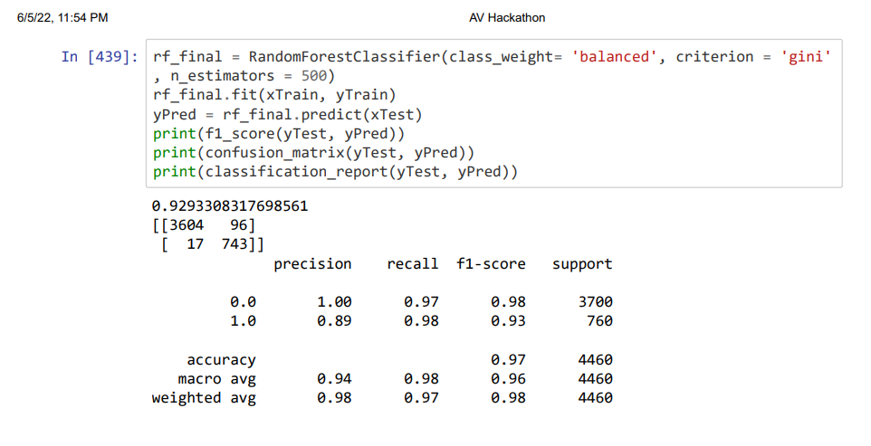

# Analytics-Vidya-Hackathon
This repository shows my approach and submission for Analytics Vidya Jobathon June'22 comeptition. 

### Problem Statement
We are given a dataset containing leads information. Leads are potential buyers that company has acquired through offline or online campaigns. The main aim is to make a model that will accurately predict if a lead will buy a product from them in the next three months.

A brief summary of my approach is presented here. For more detailed view, feature engineering and EDA please check the python notebook.
### The Dataset
<b>Variables                  Meaning</b> 
id          &emsp;  &emsp; &emsp; &emsp; &emsp; &emsp; &emsp;    Id of each lead 
created_at      &ensp; &emsp;   &emsp; &emsp; &emsp; &emsp;    Date the lead was dropped 
campaign_var_1      &emsp; &emsp; &emsp; &emsp;    Variable telling us about the campaign related to lead 
campaign_var_2      &emsp; &emsp; &emsp; &emsp;    Similar variable 
products_purchased  &emsp; &emsp; &emsp;    Number of products the lead has purchased in the past 
signup_date       &emsp;  &emsp; &emsp; &emsp; &emsp;    Date the lead signed up on the website 
user_activity(1-12) &emsp; &emsp; &emsp;    Variables showing activity of the user on the website 
buy           &emsp;   &ensp; &emsp;  &emsp; &emsp; &emsp; &emsp;    The target variable, if the lead buys a product within the next 3 months 

### Model Selection & Hyperparameter Tuning
Looking at the distribution of data some models were selected like Random forest, Xgb, SVC with non linear kernel and knn for testing. Then after compairing the f1 score of all the models Random forest was selected and further tuned to get a final score of ~0.93.

